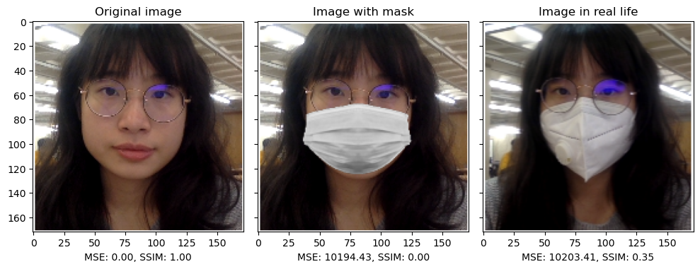
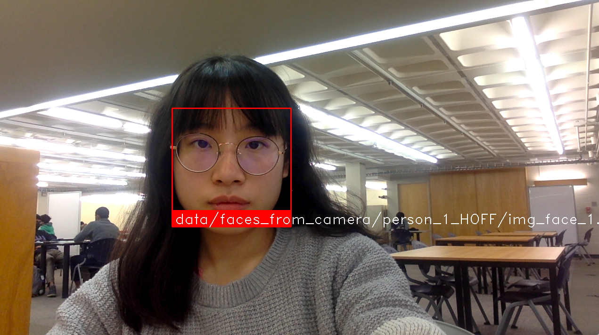
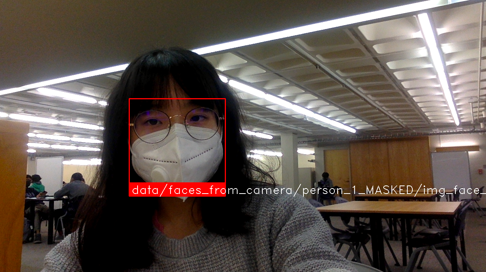

# Identify-Masked-Face
This is a facial identification project for the EN.540.635 “Software Carpentry”. 

# Project Topic:
It has been the third year since Covid-19's outbreak, we have all experienced a lot of inconveniences during this part of the time.  
A great deal of face recognition software which used to work have started to face difficulties since people are now wearing masks, thus, in this project we aim to recognize people faces with masks on and compare them with the faces without masks.  
The three milestones we needed to overcome in the project.  
1. Face identification.  
2. Mask the face.  
3. Identify and compare the masked face with the unmasked face.  
4. Identify real masked face using webcam

#### The procedure of 1.Face identification:
Show the GUI for users to take photos while they wear masks or they do not wear masks.  
1.We used a package within python/face_recognition to deal with the problem.

#### The procedure of 2.Mask the face:
We will add mask on every face we have already captured in the part1.GUI.  
1. Obtain raw mask pictures with photoshop  
2. Use the recognized face and its landmarks in step one  
3. Put the mask on to the face by attaching them to proper landmarks  

#### The procedure of 3.Identify and compare the masked face with the unmasked face.  
In this project, we want to write one function that can compare the 
similarity between our virtual masked face and the face wearitng a mask
in our life. Then we calculate the SSIM parameter, it works as the indicator of evaluation.
The img_show() function will be used in the mainbody--Interface.py and the picture
will be saved in our Identify-Masked-Face project. 
You could see that the virtual masked face is similar with the real masked face.
1. We generate the interface of the img_show comparison.
2. Use skimage to detect the MSE and SSIM parameter to check the difference
3. The comparison will show if it thinks that those virtual masked face are the same with the real masked face in daily life.
When we compare the virtual mask face with the real mask face, if the MSE difference is small and SSIM is close to 1, it indicates that they are similar, which proves that the real mask face is similar with the original face.

#### The procedure of 4. Identify real masked face using webcam
In this project, we want to show a placid everyday scene -- you will stare at the 
webcam, and it doesn't recognize you because you are wearing a mask. Our project could recognize who you
are even when you wear mask!
It won't take up a lot of your computer's memory to train complex models! We only need 
the packages which are self-contained tools in python: Face_recognition. Then we use virtual
masked faces as the new model.
Isn't that cool?
Now let's enjoy it!

1. The openCV is used in the video capture
2. Draw a rectangle around the face. Input text labels with a name below the face
3. You could find your name is showed under your face. 
4. When you wear mask, it will show name like 'JackMASKED'. 
5. When you do not wear anthing, it will show the first name you type in.

**Here Is Real Face Recognition**

**Here Is Masked Face Recognition**

# Project Arrangement

## TimeTable
11.30-12.5 Previous work reading, brain storming, face recognition and obtaining landmarks  
12.4-12.7 Adding mask to faces and start face comparing  
12.8-12.13 Making GUI and completing face comparing  
12.13-12.15 Wrap up and writing README  
12.16 Unit test, PEP8 test and Release  

## Environment Organization
**We use python 3.8.8 as our language.**  
The basic toolboxes（such as OpenCV, dlib, face_recognition）need to be pipped in the python system.    
**We also require**  
dlib==19.17.0  
OpenCV==4.5.4  
numpy==1.21.3  
scikit-image==0.18.3  
face_recognition==1.2.3  
The machine leaning model is sel-contained in the face_recognition package.

## How to use the code
**Notice: Whenever you want leave, you could type q!**  
1. Open Interface.py.  
2. Click and Run code.  
3. Follow the instruction on the command  
4. Now please take off your mask and type g and you are ready to GO! You will take a photo of yourself.  
5. Now you will see your virtual masked face, which is added by our code.  
6. Now you can type l and come to step 2.  
7. Now you can put on your mask and take a new photo.  
8. Now you can see the comparison.png.
9. Now you can see the video webcam interface. You can find your name showen under the red boxs. When you wear a mask, the user name you input while wearing a mask will be presented. When you present your face without a mask, it will show the first name you typed in

> You should not use _ or / in your input name, which might make difficult in our path recognition.  

# Support Information

## Group member: 
1. Bo Chao, bchao4@jh.edu, pkocattoss  
2. Ziying Xu, zxu92@jh.edu, HoffOFHoff

## The testing models:
The real facial model is stored here: [Models](https://pages.github.com/)

## Important Reference for this subject
> The inspiring ideas from amazing groups worldwide helped us through this this project, we would like to give them our superior respect.  
> JDAI opensource based on PyTorch:  https://github.com/JDAI-CV/FaceX-Zoo.     
> Methods such as MTCNN Mobilenet and Facenet were used for face mask detection and recognition: https://github.com/mext169/detect-and-recognize-mask-face.  
> Face recognition using the camera: https://github.com/coneypo/Dlib_face_recognition_from_camera  
> Wear the mask on people face: https://github.com/jacke121/MaskTheFace.  
> Face recognition official website: https://towardsdatascience.com/building-a-face-recognizer-in-python-7fd6630c6340  
> Scikit offcial website: https://scikit-image.org/  

# Acknowledgement 
**Special thanks towards our teacher Divya Sharma.**  
We are very grateful for your patience and rigorous research attitude.  
